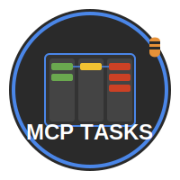

# MCP Task Manager Server

<div align="center">
  
</div>

A local Model Context Protocol (MCP) server providing backend tools for client-driven project and task management using a SQLite database.

## Overview

This server acts as a persistent backend for local MCP clients (like AI agents or scripts) that need to manage structured task data within distinct projects. It handles data storage and provides a standardized set of tools for interaction, while the strategic workflow logic resides within the client.

**Key Features:**

* **Project-Based:** Tasks are organized within distinct projects.
* **SQLite Persistence:** Uses a local SQLite file (`./data/taskmanager.db` by default) for simple, self-contained data storage.
* **Client-Driven:** Provides tools for clients; does not dictate workflow.
* **MCP Compliant:** Adheres to the Model Context Protocol for tool definition and communication.
* **Task Management:** Supports creating projects, adding tasks, listing/showing tasks, updating status, expanding tasks into subtasks, and identifying the next actionable task.
* **Import/Export:** Allows exporting project data to JSON and importing from JSON to create new projects.

## Implemented MCP Tools

The following tools are available for MCP clients:

* **`createProject`**:
  * **Description:** Creates a new, empty project.
  * **Params:** `projectName` (string, optional, max 255)
  * **Returns:** `{ project_id: string }`
* **`addTask`**:
  * **Description:** Adds a new task to a project.
  * **Params:** `project_id` (string, required, UUID), `description` (string, required, 1-1024), `dependencies` (string[], optional, max 50), `priority` (enum 'high'|'medium'|'low', optional, default 'medium'), `status` (enum 'todo'|'in-progress'|'review'|'done', optional, default 'todo')
  * **Returns:** Full `TaskData` object of the created task.
* **`listTasks`**:
  * **Description:** Lists tasks for a project, with optional filtering and subtask inclusion.
  * **Params:** `project_id` (string, required, UUID), `status` (enum 'todo'|'in-progress'|'review'|'done', optional), `include_subtasks` (boolean, optional, default false)
  * **Returns:** Array of `TaskData` or `StructuredTaskData` objects.
* **`showTask`**:
  * **Description:** Retrieves full details for a specific task, including dependencies and direct subtasks.
  * **Params:** `project_id` (string, required, UUID), `task_id` (string, required)
  * **Returns:** `FullTaskData` object.
* **`setTaskStatus`**:
  * **Description:** Updates the status of one or more tasks.
  * **Params:** `project_id` (string, required, UUID), `task_ids` (string[], required, 1-100), `status` (enum 'todo'|'in-progress'|'review'|'done', required)
  * **Returns:** `{ success: true, updated_count: number }`
* **`expandTask`**:
  * **Description:** Breaks a parent task into subtasks, optionally replacing existing ones.
  * **Params:** `project_id` (string, required, UUID), `task_id` (string, required), `subtask_descriptions` (string[], required, 1-20, each 1-512), `force` (boolean, optional, default false)
  * **Returns:** Updated parent `FullTaskData` object including new subtasks.
* **`getNextTask`**:
  * **Description:** Identifies the next actionable task based on status ('todo'), dependencies ('done'), priority, and creation date.
  * **Params:** `project_id` (string, required, UUID)
  * **Returns:** `FullTaskData` object of the next task, or `null` if none are ready.
* **`exportProject`**:
  * **Description:** Exports complete project data as a JSON string.
  * **Params:** `project_id` (string, required, UUID), `format` (enum 'json', optional, default 'json')
  * **Returns:** JSON string representing the project.
* **`importProject`**:
  * **Description:** Creates a *new* project from an exported JSON string.
  * **Params:** `project_data` (string, required, JSON), `new_project_name` (string, optional, max 255)
  * **Returns:** `{ project_id: string }` of the newly created project.
* **`updateTask`**:
  * **Description:** Updates specific details (description, priority, dependencies) of an existing task.
  * **Params:** `project_id` (string, required, UUID), `task_id` (string, required, UUID), `description` (string, optional, 1-1024), `priority` (enum 'high'|'medium'|'low', optional), `dependencies` (string[], optional, max 50, replaces existing)
  * **Returns:** Updated `FullTaskData` object.
* **`deleteTask`**:
  * **Description:** Deletes one or more tasks (and their subtasks/dependency links via cascade).
  * **Params:** `project_id` (string, required, UUID), `task_ids` (string[], required, 1-100)
  * **Returns:** `{ success: true, deleted_count: number }`
* **`deleteProject`**:
  * **Description:** Permanently deletes a project and ALL associated data. **Use with caution!**
  * **Params:** `project_id` (string, required, UUID)
  * **Returns:** `{ success: true }`

*(Note: Refer to the corresponding `src/tools/*Params.ts` files for detailed Zod schemas and parameter descriptions.)*

## Getting Started

1. **Prerequisites:** Node.js (LTS recommended), npm.
2. **Install Dependencies:**

    ```bash
    npm install
    ```

3. **Run in Development Mode:** (Uses `ts-node` and `nodemon` for auto-reloading)

    ```bash
    npm run dev
    ```

    The server will connect via stdio. Logs (JSON format) will be printed to stderr. The SQLite database will be created/updated in `./data/taskmanager.db`.
4. **Build for Production:**

    ```bash
    npm run build
    ```

5. **Run Production Build:**

    ```bash
    npm start
    ```

## Configuration

* **Database Path:** The location of the SQLite database file can be overridden by setting the `DATABASE_PATH` environment variable. The default is `./data/taskmanager.db`.
* **Log Level:** The logging level can be set using the `LOG_LEVEL` environment variable (e.g., `debug`, `info`, `warn`, `error`). The default is `info`.

## Project Structure

* `/src`: Source code.
  * `/config`: Configuration management.
  * `/db`: Database manager and schema (`schema.sql`).
  * `/repositories`: Data access layer (SQLite interaction).
  * `/services`: Core business logic.
  * `/tools`: MCP tool definitions (*Params.ts) and implementation (*Tool.ts).
  * `/types`: Shared TypeScript interfaces (currently minimal, mostly in repos/services).
  * `/utils`: Logging, custom errors, etc.
  * `createServer.ts`: Server instance creation.
  * `server.ts`: Main application entry point.
* `/dist`: Compiled JavaScript output.
* `/docs`: Project documentation (PRD, Feature Specs, RFC).
* `/data`: Default location for the SQLite database file (created automatically).
* `tasks.md`: Manual task tracking file for development.
* Config files (`package.json`, `tsconfig.json`, `.eslintrc.json`, etc.)

## Linting and Formatting

* **Lint:** `npm run lint`
* **Format:** `npm run format`

(Code is automatically linted/formatted on commit via Husky/lint-staged).
